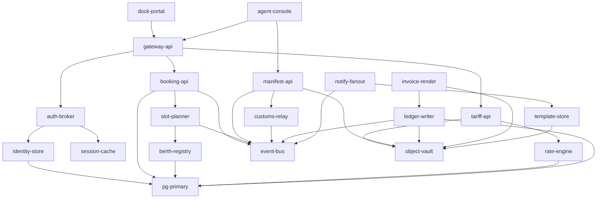

# Harbour platform — service map

Harbour is the port operations platform. This page is what a maintainer opens
during an incident, at 03:00, on a phone, to answer one question: *what else
breaks if this breaks?*

## Where to start

| You need to | Go to |
| --- | --- |
| Know what a service does | [The twenty services](#the-twenty-services) |
| Know what breaks with it | [Service dependencies](#service-dependencies) |
| Ship a change safely | [Deploy order](#deploy-order) |
| Reach a human | [On call](#on-call) |
| Recognise a known outage | [Known failure modes](#known-failure-modes) |

## Service dependencies

A service cannot start, and cannot serve, until everything it calls is healthy.

Dependencies are not transitive in the graph below — follow the arrows
you need, then follow theirs.

## The twenty services

### dock-portal

The public booking site. Browser-facing, no API of its own. Owned by the berth rotation.

### agent-console

The staff console used by dock agents on shift. Owned by the berth rotation.

### gateway-api

Public HTTP entry point. Terminates TLS, routes, rate-limits. Owned by the platform rotation.

### auth-broker

Issues and validates session tokens for every caller. Owned by the identity rotation.

### identity-store

System of record for accounts and their roles. Owned by the identity rotation.

### session-cache

In-memory store for live sessions. Loses state on restart. Owned by the identity rotation.

### booking-api

Accepts and amends berth bookings. Owned by the berth rotation.

### slot-planner

Assigns a berth and a window to an accepted booking. Owned by the berth rotation.

### berth-registry

The catalogue of berths, their draft limits and their status. Owned by the berth rotation.

### tariff-api

Quotes a price for a booking before it is confirmed. Owned by the billing rotation.

### rate-engine

Evaluates the published tariff rules against a quote request. Owned by the billing rotation.

### manifest-api

Accepts cargo manifests and validates their structure. Owned by the customs rotation.

### customs-relay

Forwards accepted manifests to the national customs endpoint. Owned by the customs rotation.

### event-bus

Durable event log. Every asynchronous hand-off passes through it. Owned by the platform rotation.

### ledger-writer

Appends billing events. The only writer of the billing ledger. Owned by the billing rotation.

### invoice-render

Renders a monthly invoice document on demand. Owned by the billing rotation.

### notify-fanout

Delivers email and SMS notifications to shippers and agents. Owned by the notify rotation.

### template-store

Holds the notification templates and their translations. Owned by the notify rotation.

### object-vault

Blob storage for documents, manifests and rendered invoices. Owned by the storage rotation.

### pg-primary

The primary relational store. Every write of record lands here. Owned by the storage rotation.

## Deploy order

There is no fixed sequence to memorise. The pipeline derives the order from the
manifest at build time: a service is rolled out only once everything it calls is
already at the target version, and a service deployed ahead of that will start,
fail its readiness probe, and be restarted by the scheduler until it gives up.

Deploys go out on Tuesday and Thursday mornings. A deploy outside that window
needs a second approver from the owning team.

## On call

| Rotation | Owns | Escalate to |
| --- | --- | --- |
| platform | `gateway-api`, `event-bus` | the duty architect |
| berth | `dock-portal`, `agent-console`, `booking-api`, `slot-planner`, `berth-registry` | the port supervisor on shift |
| identity | `auth-broker`, `identity-store`, `session-cache` | the platform rotation |
| billing | `tariff-api`, `rate-engine`, `ledger-writer`, `invoice-render` | the finance controller |
| customs | `manifest-api`, `customs-relay` | the compliance officer, always |
| notify | `notify-fanout`, `template-store` | the platform rotation |
| storage | `object-vault`, `pg-primary` | the duty architect |

Page the billing rotation before restarting anything under it:
a missed billing event is not recoverable by replay. Page the compliance
officer for anything under customs, at any hour, because the filing deadline is
statutory and
a missed customs event is not recoverable by replay.

## Known failure modes

**A `session-cache` restart logs everyone out.** It holds state only in memory.
`auth-broker` re-issues tokens on the next request, so the outage lasts one
round trip, but every open console session is dropped.

**`object-vault` throttling is silent.** The client library retries with backoff
and reports success, so the symptom is latency somewhere else entirely, not an
error in `object-vault`.

**`ledger-writer` cannot catch up on its own.** After an outage it needs its
backlog drained manually before it will accept new events; the
`harbour-ledger-replay` job does this.

**`customs-relay` fails closed.** When the national endpoint is unreachable it
stops accepting work rather than buffering it, which surfaces as rejected
manifests rather than as a customs incident.

**A `pg-primary` failover holds writes for about forty seconds.** Reads continue
from the replica. Anything that writes will retry, and anything that retries
without a jitter will retry all at once.

**Rendered invoices survive a `template-store` outage.** Templates are read at
render time, so a missing template fails the render rather than producing a
blank document.
